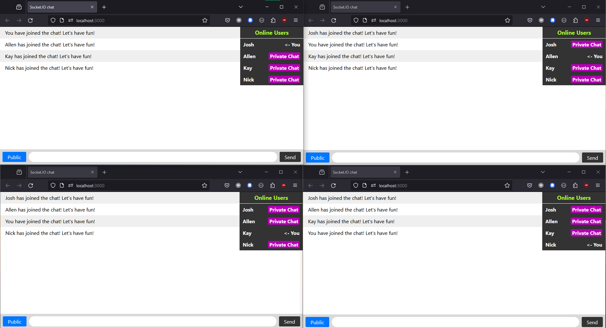
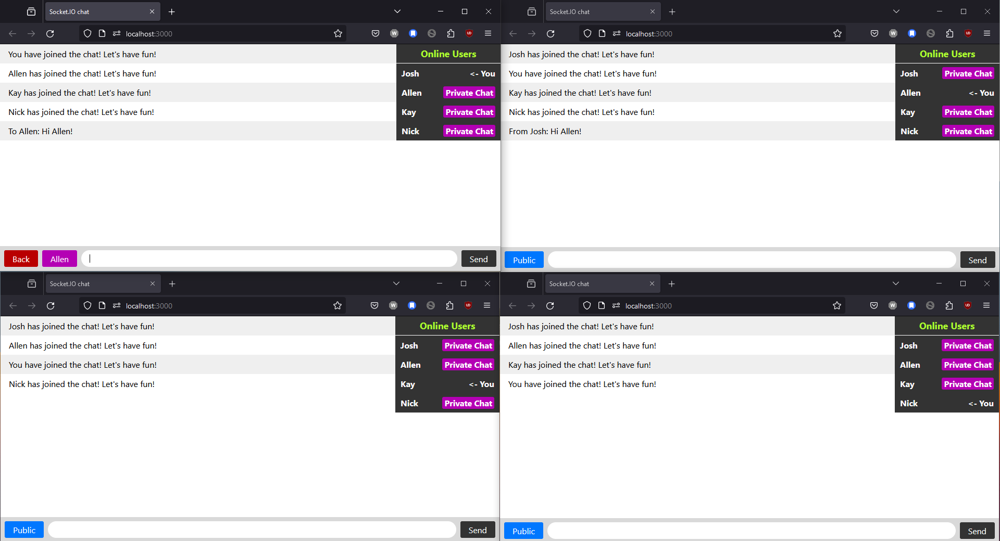
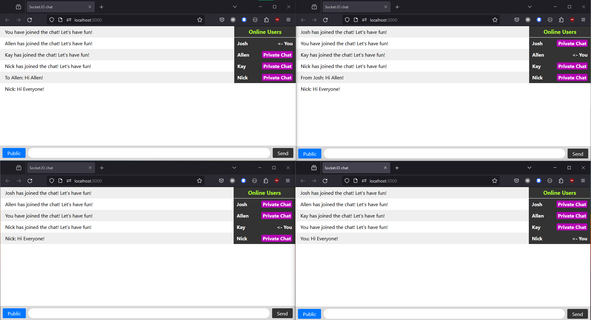

# Socket.io v4 test project for learning

A simple chat room app made with Socket.io based on websocket. We need websocket for this type of application because this is the most efficient way to update states to many clients. Otherwise we need HTTP long polling on each client and keep hammering the server, which brings in lots of overhead and is a waste of network and computing resource.

## QuickStart

Dependency: `pnpm i`

Start the server: `npm start`

## Overview

- Default Page

1. Get users nickname using prompts.
2. View of all currently online users.
3. Input form at the bottom for writing chat messages.
4. View chat messages sent after you connect to the room.
5. Show which user is typing

- Private Chat

Click `Private Chat` to select the user you want to DM. Only the target user will see your private message. Click `Back` to return to Public channel.

- Broadcasting

When in Public channel, click `Send` will broadcast your message with everyone in the room, except yourself.

## TODO

1. Add proper comments in src code
2. https://socket.io/docs/v4/tutorial/ Steps 6 - 9
3. BUG: Show `{user} is typing...` message only to target user in private chat.
4. Build an instant messaging app in React + Express + TypeScript + Socket.IO
   - With all the functionalities above
   - Persist messages in databases
   - User signup, log in/log out, basic authentication
   - Split the whole app into different channels(rooms)
   - Support images/videos transfer
   - Users could mention another user in channels
   - Integrate LLMs into the app
   - And more...

## Resources on websocket

- https://stackoverflow.com/questions/26919310/python-how-can-server-initiate-a-connection-to-client
- https://github.com/websockets/ws
- https://ably.com/topic/websockets-vs-http
- https://hookdeck.com/webhooks/guides/when-to-use-webhooks
- https://stackoverflow.com/questions/44731313/at-what-point-are-websockets-less-efficient-than-polling
- https://tsh.io/blog/how-to-scale-websocket/

**Socket.IO V4 Cheat Sheet**

- https://socket.io/docs/v4/emit-cheatsheet/
